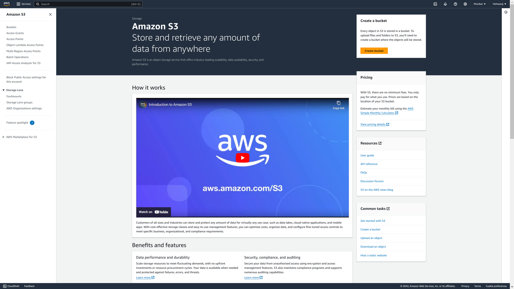
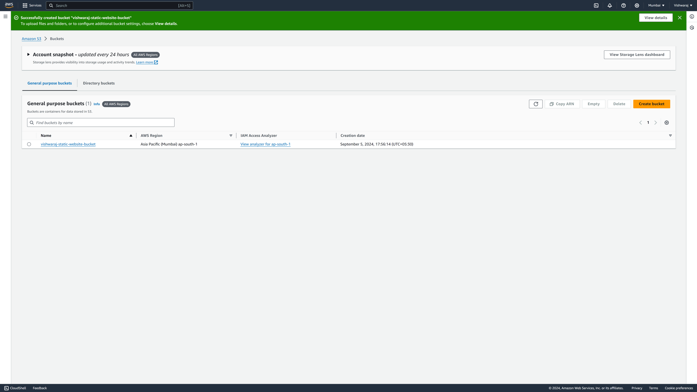
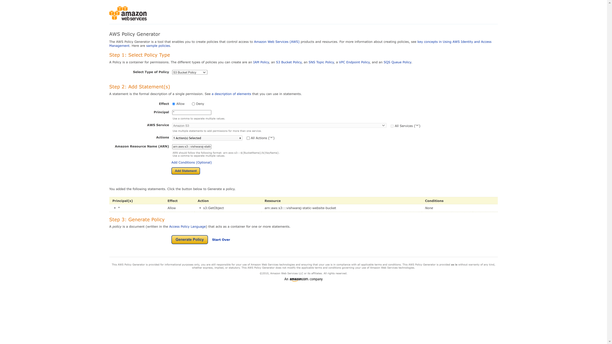
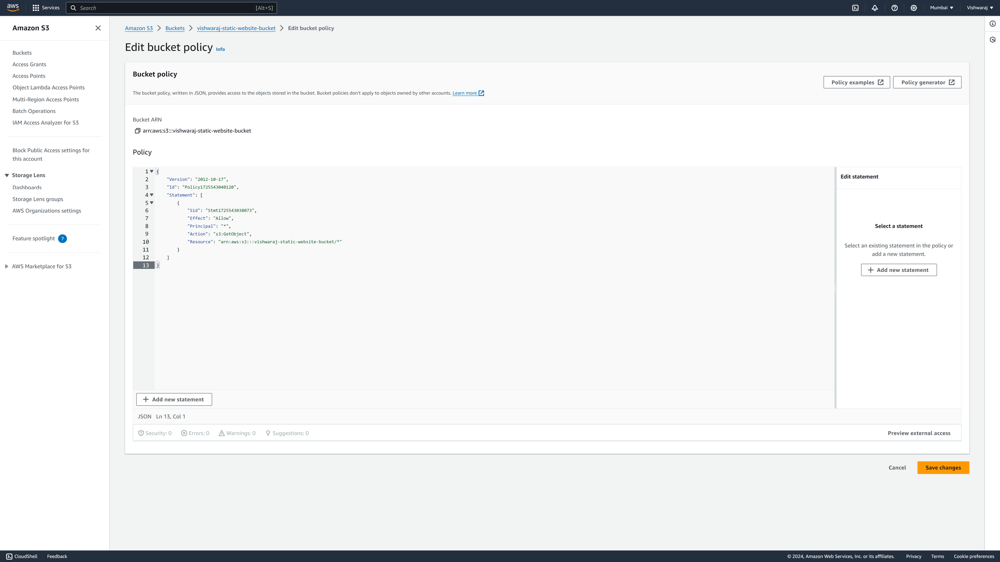
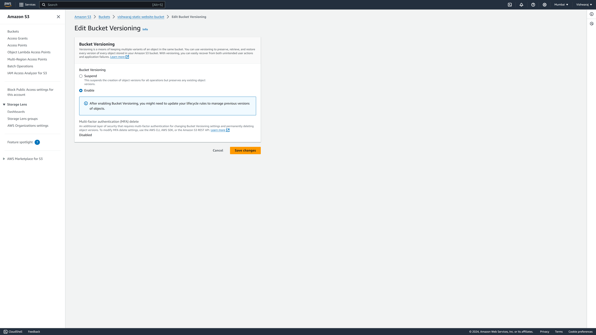
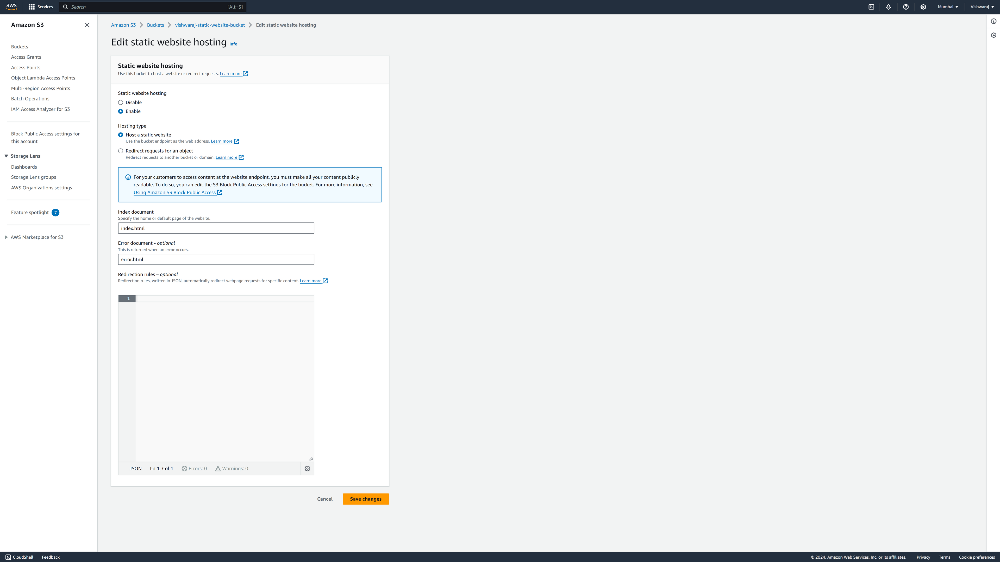
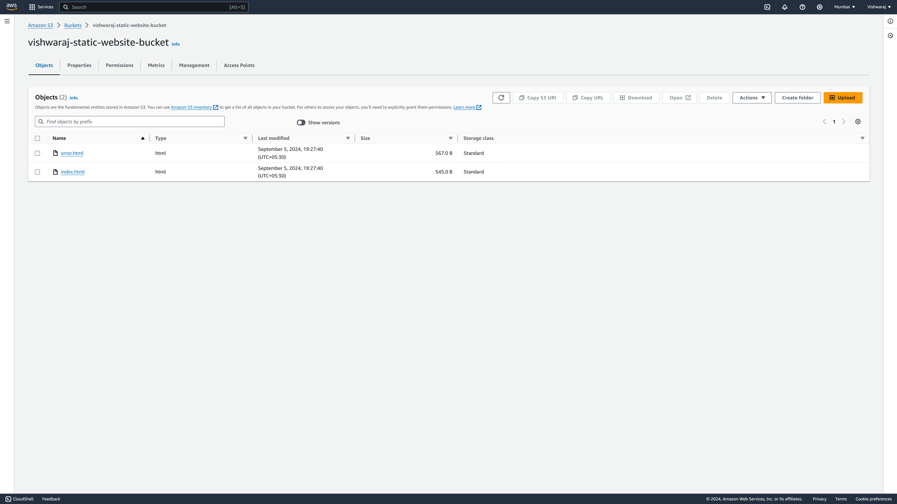
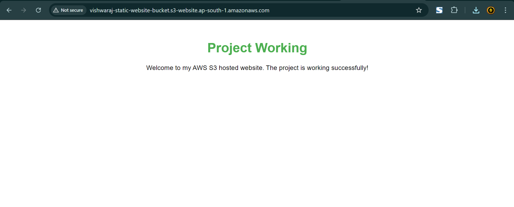
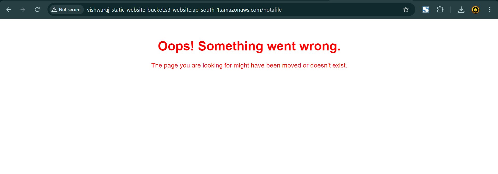

# Hosting a Static Website Using Amazon S3 with Custom Bucket Policy

## Objective:

In this project, I am setting up an Amazon S3 bucket to handle file operations and host a static website. This includes configuring public access, enabling versioning, and serving HTML files through the S3 bucket.

---

## Steps:

### 1. Create S3 Bucket

- First, I logged into my AWS Management Console and navigated to the S3 service.

 
  <em>Figure: S3 service dashboard</em>

- I created a new S3 bucket by selecting "Create bucket" and provided a unique bucket name. I kept the region as the default.
- Under "Object Ownership," I selected "ACLs disabled," which ensures that the bucket owner has full control.
- For "Block Public Access settings for this bucket," I unchecked "Block all public access." This allowed me to make the bucket publicly accessible later.
- I kept the rest of the settings as default and clicked "Create bucket".

 
  <em>Figure: Create bucket successfully</em>

---

### 2. Grant Public Access via Bucket Policy

- Once the bucket was created, I needed to grant public access so that files can be accessed over the web.
- I navigated to the "Permissions" tab of the bucket and clicked on "Bucket Policy."
- Instead of writing the policy manually, I used the "Policy generator" provided by AWS:

  - I clicked on the "Policy generator" link.
  - In the Policy Generator
    - **Select Type of Policy:** I chose "S3 Bucket Policy."
    - **Principal:** I entered * (which means anyone can access the files).
    - **Actions:** I selected `GetObject` to allow read access to the objects in the bucket.
    - **Amazon Resource Name (ARN):** I entered the ARN of my bucket in the format `arn:aws:s3:::<bucket-name>/*`. I replaced `<bucket-name>` with my actual bucket name.

  

  
   
  <em>Figure: AWS policy generator</em>
  

  - I clicked "Add Statement" and then "Generate Policy."
  - I copied the generated policy and pasted it into the "Bucket Policy" editor in the Permissions tab.

 
  <em>Figure: Edit bucket policy</em>

- After saving the policy, my bucket was publicly accessible, allowing anyone to access the fi les within.
---

### 3. Enable Versioning on S3 Bucket

- To ensure that I can preserve, retrieve, and restore previous versions of objects, I enabled versioning on my S3 bucket.
- I went to the "Properties" tab of the bucket and clicked on "Versioning."
- I enabled versioning and saved the changes. This step is crucial for maintaining data integrity and recovering old versions of files if needed.

 
  <em>Figure: Enable bucket versioning</em>

---

### 4. Host a Static Website on S3

- Next, I configured the bucket to host a static website. For this, I needed to serve HTML files through the bucket.
- In the "Properties" tab, I scrolled down to "Static website hosting" and enabled it.
- I selected "Use this bucket to host a website" and specified the index document (e.g., `index.html`) and an optional error document (e.g., `error.html`).

- After saving the settings, I uploaded my HTML files to the bucket using the "Upload" feature in the S3 console.

 
  <em>Figure: html files uploaded in S3 bucket</em>

- Once the upload was complete, my static website was accessible via the bucket's website endpoint URL, which AWS provided in the static website hosting section.

  
   
  <em>Figure: index.html page shown in browser after S3 hosting</em>

  
   
  <em>Figure: error.html page shown in browser after S3 hosting</em>

---

## ✅ Conclusion:

By following these steps, I successfully created an S3 bucket, configured a custom bucket policy to manage public access, enabled versioning, and hosted a static website. This project not only helped me understand how to use Amazon S3 for file storage and static website hosting but also provided valuable insights into access control management and the application of bucket policies for security and access control.

---

## ✍️ Author

**Vishwaraj Kumar**  
🔗 [GitHub Profile](https://github.com/vishwaraj-kumar)  
🔗 [LinkedIn Profile](https://www.linkedin.com/in/vishwaraj-kumar/)
